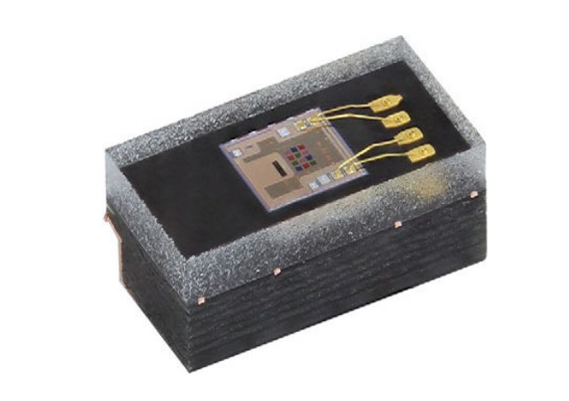
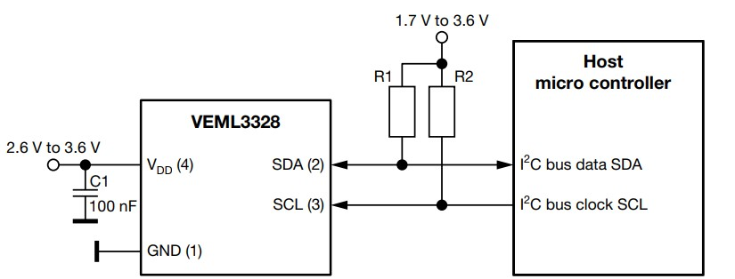

# VEML3328 
An arduino library for Vishay VEML3328 and VEML3328sl RGBCIR Color Sensor



Please refer to the datasheet for additional information https://www.vishay.com/docs/84968/veml3328.pdf
# Wiring
The sensor communicates with the host microcontroller through I2C communication and it has 4 pins, VCC, GND, SCL and SDA. The supply voltage should not exceed 3.6V and the I2C lines should be pulled up to VCC through 2.2K resistors as shown in the diagram below:



# Installation
Download the library as .zip and add it to [Arduino IDE](http://www.arduino.cc/en/main/software) via:

	Sketch => Include Library => Add .ZIP Library...

# Sensor Configuration
The sensor allows for several configurations which are accessible through the command register. This library can access and edit these confugation bits through the following functions:

## Initialization:
```
RGBCIR.begin(); //look for the sensor in the I2C bus, returns 0 if sensor not found 
RGBCIR.Enable(); //Turn on the sensor'channels (off by default)
RGBCIR.Disable(); //Turn off the sensor'channels (off by default)
```
 ## Parameters configurations:
 ```
 setSensitivity(); //toggle between two sensitivity modes; low_sens for low sensitivity and high_sens for high
 setGain(); //sets the gain of the sensor, choose between 0.5, 1, 2, 4 (1 default)
 setDG(); //set the digital gain of the sensor, choose between 1, 2, 4 (1 default)
 setIntegrationTime(); //set the integration time of the sensor, choose between IT_50MS, IT_100MS, IT_200MS, IT_400MS (in milliseconds)
  ```
## Reading the color channels from sensor:
```
 getRed(); //returns the red channel's reading from 0-65535
 getGreen(); //returns the green channel's reading from 0-65535
 getBlue(); //returns the blue channel's reading from 0-65535
 getClear(); //returns the clear channel's reading from 0-65535
 getIR(); //returns the IR channel's reading from 0-65535
 ```
# Easy setup
Plug the sensor to the Arduino board and run the [Example](Examples/Read_RGBCIR.ino). Open the serial plotter or the serial monitor to see the readings from different channels. A better viewing experience is through the serial plotter as the color of the line represents the channel, the serial plotter can be accessed on the Arduino IDE via:

``Tools => Serial Plotter``

Enjoy 🤓

